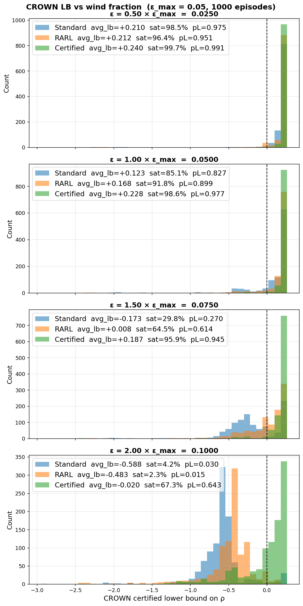
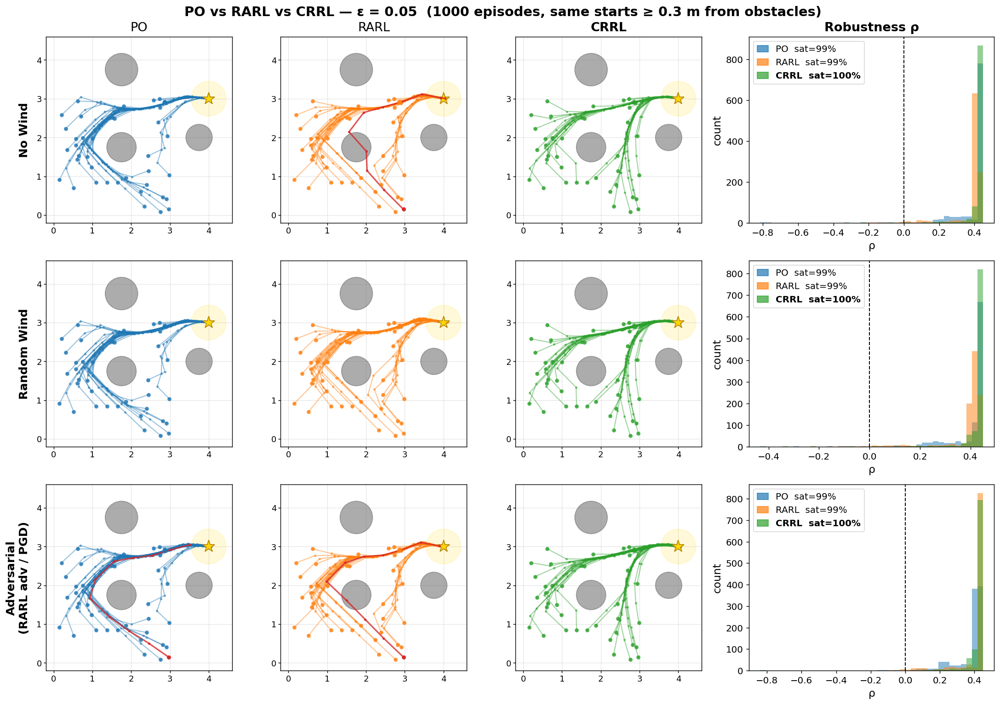
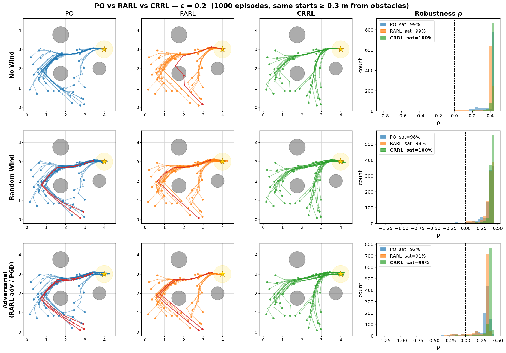
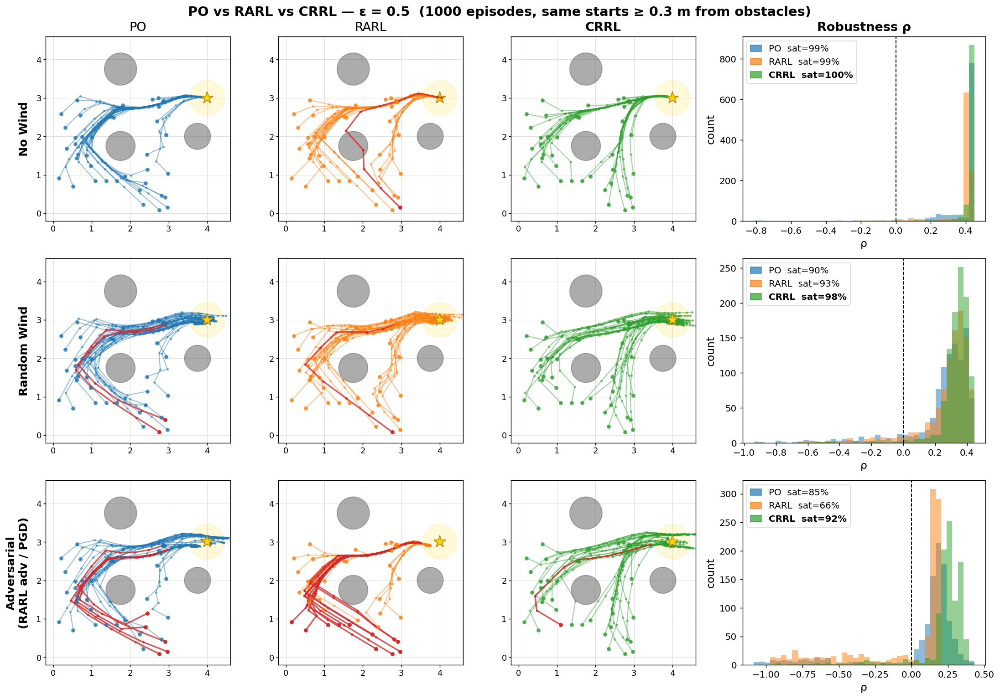
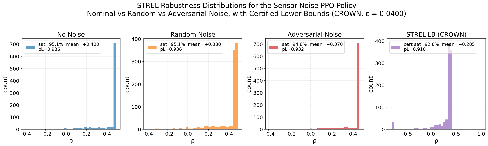
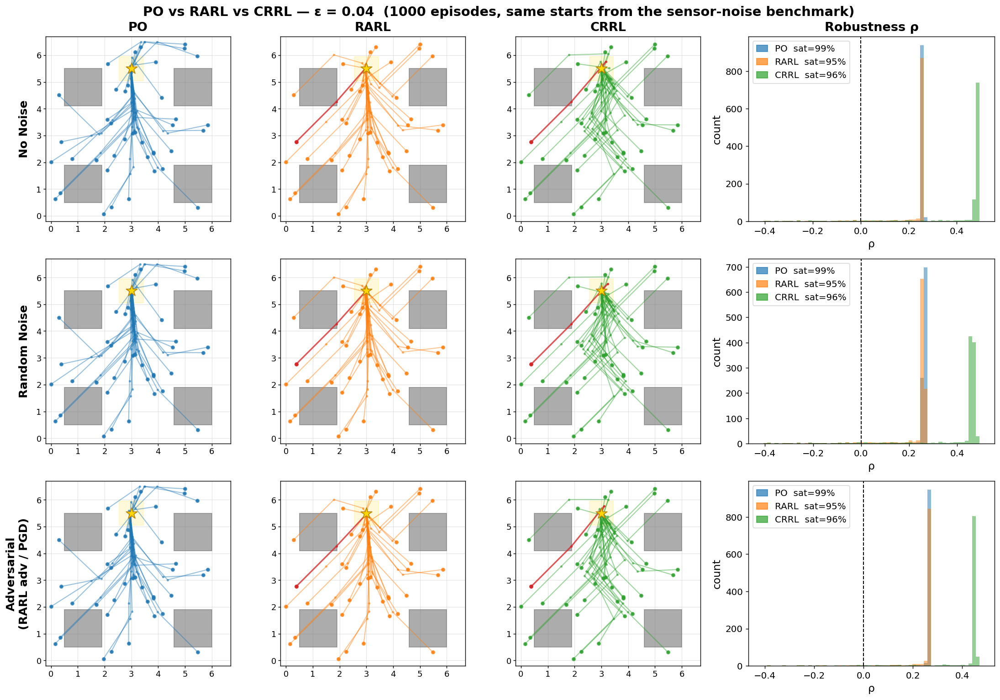

# Certifiably Robust Reinforcement Learning (CRRL)

This repository contains the implementation of **Certified Policy
Optimization** for learning policies that satisfy **Spatio-Temporal
Reach and Escape Logic (STREL)** specifications under bounded
disturbances.

The method combines:

-   Differentiable **STREL monitoring**
-   Neural network verification via **LiRPA**
-   **Certified policy optimization**

The objective is to learn policies that **maximize a certified lower
bound on specification robustness**, providing guarantees that the task
is satisfied for all disturbances within a prescribed uncertainty set.

------------------------------------------------------------------------

# Method Overview

CRRL integrates learning and verification by optimizing a **certified
robustness objective** rather than a standard reward.
The approach trains a neural policy while **propagating verification
bounds through the full trajectory computation graph**.

------------------------------------------------------------------------

# Certified Policy Optimization

The training algorithm optimizes a mixture of:

-   **nominal robustness**
-   **certified robustness bounds**

obtained via LiRPA verification.

## Training Procedure

### 1. Policy Initialization

A neural policy `πθ` is initialized randomly.

A **LiRPA wrapper** is built around the rollout module to enable **bound
propagation through the trajectory**.

------------------------------------------------------------------------

### 2. Curriculum Learning

Training runs for **K iterations**.

At iteration `k`:

    λ = k / (K − 1)
    ε = λ ε_max

The disturbance magnitude is gradually increased so that:

-   training begins under **nominal conditions**
-   the policy progressively encounters **larger disturbances**

------------------------------------------------------------------------

### 3. Certified Bound Computation

For each batch of initial states:

-   compute a **certified lower bound** on STREL robustness
-   compute **nominal robustness** with zero disturbance

These are combined into a mixed estimate

    m = λ ρ_cert + (1 − λ) ρ_nom

This stabilizes training and gradually shifts optimization toward
**certified robustness**.

------------------------------------------------------------------------

### 4. Optimization

The certification loss is evaluated over the batch and policy parameters
are updated using **gradient descent**.

------------------------------------------------------------------------

### 5. Two-Stage Certification

Training uses two verification methods:

#### Phase 1 --- CROWN-IBP (first 90%)

-   fast
-   coarse bounds

#### Phase 2 --- CROWN (final 10%)

-   slower
-   tighter bounds
-   improves certified guarantees

------------------------------------------------------------------------
### Algorithm

The following pseudocode summarizes the training procedure used for
**Certified Policy Optimization (CRRL)**.

    **Algorithm: Certified Policy Optimization**

    **Inputs:**
        πθ           policy
        rθ           rollout module
        r̂θ           LiRPA model
        K            training iterations
        B            batch size
        ε_max        maximum disturbance

    1. Initialize θ randomly
    2. r̂θ ← LiRPA(rθ)            // build LiRPA wrapper

    3. for k = 0, 1, ..., K−1 do

    4.     λ ← k / (K − 1)
    5.     ε ← ε_max · λ

    6.     Sample {y₀⁽ⁱ⁾}ᵢ₌₁ᴮ from valid start region

    7.     lb⁽ⁱ⁾ ← r̂θ(y₀⁽ⁱ⁾, ε)        // certified lower bound
    8.     ρ_nom⁽ⁱ⁾ ← rθ(y₀⁽ⁱ⁾, 0)

    9.     Compute mixed robustness m⁽ⁱ⁾

    10.    Compute certification loss L_cert

    11.    θ ← θ − η ∇θ L_cert         // gradient descent update

    12. end for

    13. return θ

This procedure trains a neural policy by optimizing a **certified
robustness objective**. The disturbance level is gradually increased
during training via a curriculum parameter λ, allowing the policy to
first learn nominal behavior and then become robust to larger
disturbances.

------------------------------------------------------------------------

# Experimental Evaluation

We evaluate CRRL on **reach--avoid navigation tasks** under two types of
disturbances:

-   **Wind disturbances** (action perturbations)
-   **Sensor noise** (observation perturbations)

The following baselines are compared:

  Method   Description
  -------- -------------------------------------------
  PO       Policy Optimization
  RARL     Robust Adversarial Reinforcement Learning
  CRRL     Proposed Certified RL
  PPO      Scalar-reward RL baseline

Metrics include:

-   STREL robustness
-   certified lower bounds
-   certified satisfaction rate
-   statistical confidence bounds

------------------------------------------------------------------------

# Wind Disturbance Results

## Certified Robustness vs Disturbance

This plot shows the **certified robustness lower bounds** for policies
trained with PO, RARL, and CRRL as the wind disturbance magnitude
increases.

### Observations

-   **CRRL consistently achieves the highest certified robustness**
-   CRRL maintains **positive certified bounds for larger disturbances**
-   PO and RARL degrade more rapidly

CRRL therefore provides **stronger verifiable guarantees** under
increasing disturbance levels.

------------------------------------------------------------------------

## Trajectory Comparison

Columns correspond to policies trained with:

1.  PO\
2.  RARL\
3.  CRRL

under **wind disturbance ε = 0.05**.

The right column shows **robustness distributions across 1000 initial
states**.

### Observations

-   All methods achieve good nominal performance
-   **CRRL produces trajectories with larger obstacle clearance**
-   robustness distributions shift toward **higher positive values**

------------------------------------------------------------------------
## Numerical Results (Wind Disturbance)

Method	ε = 0.025	ε = 0.05	ε = 0.075	ε = 0.1
PO LB	+0.210	+0.123	-0.173	-0.588
PO CertSat (%)	98.5	85.1	29.8	4.2
PO pL (%)	97.5	82.7	27.0	3.0
				
RARL LB	+0.212	+0.168	+0.008	-0.483
RARL CertSat (%)	96.4	91.8	64.5	2.3
RARL pL (%)	95.1	89.9	61.4	1.5
				
CRRL LB	+0.240	+0.228	+0.187	-0.020
CRRL CertSat (%)	99.7	98.6	95.9	67.3
CRRL pL (%)	99.1	97.7	94.5	64.5

These results summarize certified performance under increasing wind disturbances.
CRRL consistently achieves the largest certified robustness margins and maintains significantly higher certified satisfaction rates as disturbances increase.

------------------------------------------------------------------------

## Generalization to Strong Disturbances

Training disturbance:

    ε_train = 0.05

Evaluation disturbances:

-   **ε = 0.2** (4× training)
-   **ε = 0.5** (10× training)

### Wind = 0.2

### Wind = 0.5

As disturbance magnitude increases:

-   PO and RARL increasingly violate the specification
-   trajectories deviate toward obstacles
-   goal reachability deteriorates

CRRL instead:

-   maintains **safer trajectories**
-   preserves **larger robustness margins**
-   retains a larger fraction of **specification-satisfying
    trajectories**

Even under disturbances **10× larger than those used during training**,
CRRL maintains strong robustness.

------------------------------------------------------------------------
## PPO Baseline (Scalar Reward)

This plot shows STREL robustness and certified lower bounds for a PPO policy trained with a **scalar reward**. Although PPO achieves reasonable empirical performance: - its **certified robustness bounds are weak** - certification often fails This highlights the importance of **training with STREL-aligned objectives**.

------------------------------------------------------------------------

# Sensor Noise Results

## Certified Robustness vs Disturbance

CRRL maintains **positive certified robustness for larger sensor noise
levels**, while baselines degrade faster.

------------------------------------------------------------------------

## Trajectory Comparison

Columns correspond to PO, RARL, and CRRL policies under **sensor noise ε
= 0.01**.

Observations:

-   empirical satisfaction remains high (\>95%)
-   **CRRL maintains larger safety margins**
-   robustness distributions shift toward **higher positive values**

------------------------------------------------------------------------

## Numerical Results (Sensor Noise)

Method	ε = 0.02	ε = 0.04	ε = 0.06	ε = 0.08
PO LB	+0.247	+0.234	+0.214	+0.181
PO CertSat (%)	98.6	97.7	97.0	95.3
PO pL (%)	97.7	96.9	95.7	93.8
				
RARL LB	+0.230	+0.227	+0.223	+0.216
RARL CertSat (%)	95.4	95.4	95.3	95.3
RARL pL (%)	93.9	93.9	93.8	93.8
				
CRRL LB	+0.400	+0.343	+0.305	+0.251
CRRL CertSat (%)	95.7	95.4	94.8	92.7
CRRL pL (%)	94.3	93.9	93.2	90.9

Under sensor noise, CRRL again achieves substantially higher certified robustness bounds, while maintaining comparable certified satisfaction rates.
------------------------------------------------------------------------

## PPO Baseline (Scalar Reward)

Although PPO achieves reasonable empirical performance, its **certified
robustness bounds are weak**, highlighting the importance of
**STREL-aligned training objectives**.

------------------------------------------------------------------------

# Key Takeaways

CRRL learns policies that are:

-   **empirically robust**
-   **provably robust**
-   resilient to **disturbances beyond training conditions**

Optimizing **certified robustness bounds** leads to policies that
maintain safety guarantees under uncertainty.

------------------------------------------------------------------------

# Future Work

Future work will focus on:

-   scaling to **longer horizons**
-   improving **verification efficiency**
-   extending to **multi-agent systems**
-   handling **probabilistic disturbances**
-   deploying on **real robotic platforms**
